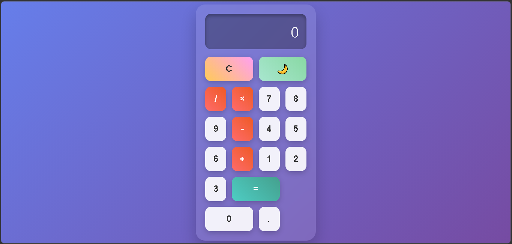

#  Calculadora

Projeto de uma calculadora simples desenvolvido com HTML, CSS e JavaScript.

## Tecnologias
- HTML
- CSS
- JavaScript

## 💻 Funcionalidades
- Operações básicas (+, -, *, /)
- Interface simples e intuitiva

##  Demonstração

##  Aprendizados
Este projeto me ajudou a entender melhor a manipulação de eventos e lógica com JavaScript.

##  Autora
Karen Andressa Giglio
